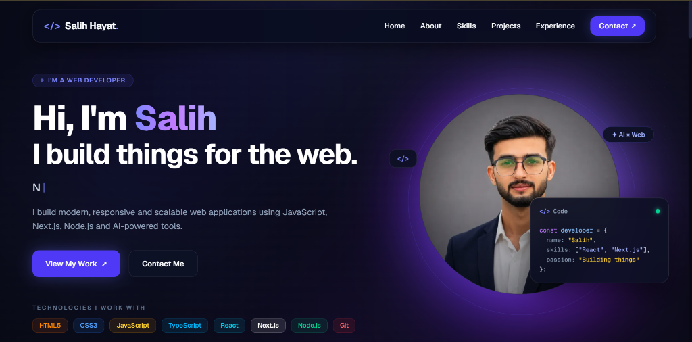
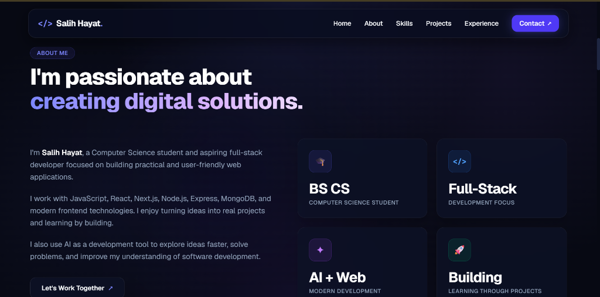
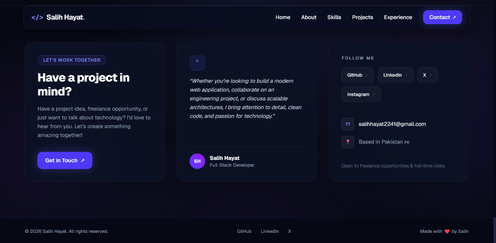
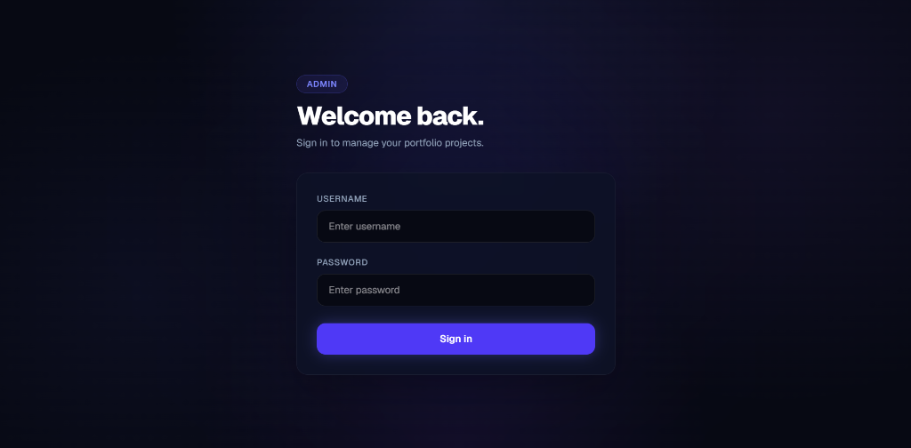
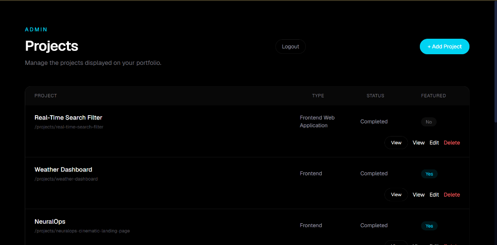

# Salih Hayat — Full-Stack Developer

<p align="left">
  A modern, dynamic developer portfolio and full-stack project showcase built with <strong>Next.js 16</strong>, <strong>React 19</strong>, <strong>TypeScript</strong>, <strong>MongoDB</strong>, and <strong>Tailwind CSS</strong>. Engineered for performance, discoverability, and dynamic content management.
</p>

<p align="left">
  <a href="https://salih-portfolio-seven.vercel.app/">
    
  </a>
  <a href="https://github.com/salih-x-tech/portfolio-v2">
    
  </a>
  <a href="https://linkedin.com/in/salih-hayat-b30097332">
    
  </a>
</p>

---

## Preview

<div align="center">
  
</div>

<br />

| About & Skills Overview | Contact & Collaboration Section |
| :--- | :--- |
|  |  |

<br />

| Admin Portal Authentication | CMS Project Management Dashboard |
| :--- | :--- |
|  |  |

---

## About Me

I am **Salih Hayat**, a Computer Science student and Full-Stack Developer focused on building responsive, scalable, and practical web applications.

- **Primary Focus**: Full-stack engineering, clean frontend design, robust backend architectures, and database modeling.
- **Core Technologies**: JavaScript (ES6+), TypeScript, React, Next.js, Node.js, Express, and MongoDB.
- **Workflow**: Leveraging AI-assisted development tools to accelerate prototyping, explore architectural patterns, and enhance problem-solving.

---

## About This Project

**Portfolio V2** is a personal developer platform designed to represent real-world engineering capability. Rather than serving as a static resume, the application combines a production-grade public portfolio with a protected administrative CMS.

### Why This Was Built
1. **Dynamic Content Delivery**: Manage projects, writeups, and media dynamically through a database instead of hardcoding JSON files.
2. **Case Study Driven**: Present software through problems, solutions, technical challenges, and key learnings.
3. **End-to-End System**: Implement full-stack patterns including database connection pooling, JWT-based route protection, automated media pipelines, and dynamic metadata generation.

---

## Features

| Category | Feature | Description |
| :--- | :--- | :--- |
| **Portfolio Showcase** | Dynamic Project Catalog | Project listing loaded from MongoDB with fallback data handling and sorting. |
| | Case Study Detail Pages | Dynamic `[slug]` pages detailing problem statements, solutions, challenges, and tech stacks. |
| | Category Filtering | Client-side filtering across `Full-Stack`, `Frontend`, and `Creative` categories. |
| | Interactive Hero Section | Typewriter roles, mouse parallax tilt effects, and responsive ambient lighting. |
| | 3D Graphics Canvas | Three.js / React Three Fiber interactive scene with lighting, controls, and materials. |
| **Admin System** | Protected CMS | Middleware-guarded administrative area (`/admin/projects`) with JWT authentication. |
| | Full Project CRUD | Comprehensive forms to create, view, update, and delete projects in MongoDB. |
| | Cloudinary Asset Uploads | Direct server-side streaming upload pipeline with 5MB file-size validation. |
| | In-Browser Image Cropping | Client-side canvas cropping powered by `react-easy-crop` before media submission. |
| **SEO & Performance** | Automated SEO Pipeline | Next.js Metadata API, Canonical URLs, Open Graph, and Twitter summary cards. |
| | Dynamic XML Sitemap | Server-generated `sitemap.xml` pulling live project slugs from MongoDB. |
| | Structured Data | Schema.org `Person` and `SoftwareSourceCode` JSON-LD for rich search engine results. |

---

## Engineering Highlights

- **Server-Side Rendering (SSR)**: Leveraging Next.js 16 App Router for fast initial page loads and search engine indexing.
- **Persistent Database Pooling**: Cached Mongoose client pattern in `lib/mongodb.ts` preventing connection exhaustion across serverless lambdas.
- **Edge-Compatible JWT Authentication**: Session cookies signed with `jose` using HMAC-SHA256, verified in Next.js edge middleware.
- **Cloudinary Buffer Streaming**: In-memory file processing and streaming to Cloudinary storage without writing temporary files to server disk.
- **Rich Schema.org Structured Data**: Automated JSON-LD generation providing search crawlers with machine-readable metadata for both author profile and individual software projects.

---

## Tech Stack

<p align="left">
  
  
  
  
  
  
  
  
  
</p>

| Layer | Technology | Purpose |
| :--- | :--- | :--- |
| **Framework** | Next.js 16.3.1 | App Router, Server Components, Route Handlers, Metadata API |
| **UI Library** | React 19.2.8 | Declarative component hierarchy and state management |
| **Language** | TypeScript 5 | End-to-end type safety across schemas, components, and APIs |
| **Styling** | Tailwind CSS v4 | Modern styling engine with utility classes and CSS variables |
| **Database** | MongoDB | Document database for project records and metadata |
| **ODM** | Mongoose 9.9.3 | Schema definition, validation, and database abstraction |
| **Auth** | Jose 6.2.10 | Edge-compatible JWT creation and token verification |
| **Media** | Cloudinary 2.11.0 | Cloud storage for portfolio project screenshots and assets |
| **Cropping** | react-easy-crop 6.2.3 | Interactive image positioning and cropping on canvas |
| **3D Engine** | Three.js & React Three Fiber | WebGL 3D rendering with Drei helpers and camera controls |

---

## Architecture

```text
┌────────────────────────────────────────────────────────────────────────┐
│                            Client (Browser)                            │
│  ┌─────────────────────────────────┐  ┌─────────────────────────────┐  │
│  │      Public Portfolio UI        │  │   Protected Admin Portal    │  │
│  │   (Hero, Projects, Case Study)  │  │ (Login, Editor, Management) │  │
│  └────────────────┬────────────────┘  └──────────────┬──────────────┘  │
└───────────────────┼──────────────────────────────────┼─────────────────┘
                    │                                  │
                    │ HTTP Requests                    │ Admin Cookie (JWT)
                    ▼                                  ▼
┌────────────────────────────────────────────────────────────────────────┐
│                        Next.js 16 App Server                           │
│  ┌─────────────────────────────────┐  ┌─────────────────────────────┐  │
│  │    Server Components (SSR)      │  │    Edge Auth Middleware     │  │
│  │   - Dynamic Metadata            │  │   - Matches /admin/projects │  │
│  │   - JSON-LD Structured Data     │  │   - Validates JWT (jose)    │  │
│  └────────────────┬────────────────┘  └──────────────┬──────────────┘  │
│                   │                                  │                 │
│                   ▼                                  ▼                 │
│  ┌──────────────────────────────────────────────────────────────────┐  │
│  │                       API Route Handlers                         │  │
│  │    /api/projects       /api/projects/[id]      /api/upload       │  │
│  └────────┬──────────────────────┬───────────────────┬──────────────┘  │
└───────────┼──────────────────────┼───────────────────┼─────────────────┘
            │                      │                   │
            ▼                      ▼                   ▼
┌──────────────────────┐ ┌───────────────────┐ ┌─────────────────────────┐
│     MongoDB Atlas    │ │ Schema.org Models │ │    Cloudinary Cloud     │
│   (Mongoose Cached)  │ │ (Search Engines)  │ │    (Media Delivery)     │
└──────────────────────┘ └───────────────────┘ └─────────────────────────┘
```

---

## Data Flow

### Public User Workflow
```text
Visitor Request ──► Next.js App Router ──► MongoDB Connection Pool
                          │                          │
                          ▼                          ▼
              Generate Dynamic Metadata      Fetch Project Records
                          │                          │
                          ▼                          ▼
               Inject Schema.org JSON-LD      Render Portfolio Page
```

### Admin Management Workflow
```text
Admin User ──► /admin/login ──► Verify Credentials ──► Set admin_token (HTTP-Only)
                                                              │
   Protected Request ◄── Middleware Verification ◄────────────┘
         │
         ├── Project Details ──► Validate Schema ──► Save to MongoDB
         └── Project Images  ──► Canvas Crop ──► /api/upload ──► Cloudinary Stream
```

---

## Project Structure

```text
portfolio-v2/
├── app/
│   ├── admin/
│   │   ├── login/
│   │   │   └── page.tsx              # Admin authentication login page
│   │   ├── projects/
│   │   │   ├── [id]/edit/page.tsx    # Project editor with image cropping
│   │   │   ├── new/page.tsx          # New project creation form
│   │   │   ├── layout.tsx            # Admin layout wrapper
│   │   │   └── page.tsx              # Admin projects management dashboard
│   │   └── layout.tsx                # Base admin layout
│   ├── api/
│   │   ├── admin/
│   │   │   ├── login/route.ts        # Admin credential validation & JWT set
│   │   │   ├── logout/route.ts       # Cookie deletion handler
│   │   │   └── upload/route.ts       # Admin asset upload endpoint
│   │   ├── projects/
│   │   │   ├── [id]/route.ts         # Single project GET, PUT, DELETE
│   │   │   └── route.ts              # Public & Admin project GET, POST
│   │   ├── test-db/route.ts          # Database connectivity check
│   │   └── upload/route.ts           # Cloudinary buffer upload handler
│   ├── projects/
│   │   ├── [slug]/page.tsx           # Dynamic case study page with JSON-LD
│   │   └── page.tsx                  # Full project catalog with filtering
│   ├── globals.css                   # Global styles & Tailwind CSS v4 setup
│   ├── layout.tsx                    # Root layout, Google fonts, Person JSON-LD
│   ├── page.tsx                      # Homepage with Hero, Projects, Skills, About
│   ├── robots.ts                     # Dynamic robots.txt generation
│   └── sitemap.ts                    # Dynamic sitemap.xml connected to MongoDB
├── components/
│   ├── layout/
│   │   ├── Footer.tsx                # Site footer component
│   │   └── Navbar.tsx                # Responsive navigation bar
│   ├── projects/
│   │   └── ProjectsGrid.tsx          # Client-side filtered project card grid
│   ├── sections/
│   │   ├── About.tsx                 # About Me narrative & metric highlights
│   │   ├── Contact.tsx               # Contact information & direct channels
│   │   ├── Experience.tsx            # Education & internship timeline
│   │   ├── Hero.tsx                  # Hero section with interactive tilt & copy
│   │   └── Skills.tsx                # Categorized skill metrics & progress bars
│   └── three/
│       └── Scene.tsx                 # Three.js 3D canvas with OrbitControls & stars
├── lib/
│   ├── models/
│   │   └── Project.ts                # Mongoose schema and model definition
│   ├── auth.ts                       # JWT creation & verification utilities (jose)
│   ├── cloudinary.ts                 # Cloudinary v2 SDK configuration
│   ├── mongodb.ts                    # Cached singleton MongoDB client
│   └── projects.ts                   # Static seed data & Project TypeScript types
├── public/
│   ├── images/                       # Profile assets
│   ├── projects/                     # Local project screenshots & mockups
│   └── screenshots/                  # Portfolio UI & admin interface screenshots
├── scripts/
│   ├── migrate-projects.js           # Database migration script for projects
│   └── update-project-images.js      # Image path alignment utility
├── middleware.ts                     # Route protection for /admin/projects/*
├── next.config.ts                    # Next.js configuration
├── package.json                      # Project dependencies & scripts
├── tsconfig.json                     # TypeScript configuration
└── README.md                         # Project documentation
```

---

## Admin Dashboard

The built-in CMS provides administrative control over all portfolio content:

- **Route Protection**: All routes under `/admin/projects/*` are guarded by `middleware.ts`. Unauthorized visitors are redirected to `/admin/login`.
- **JWT Session**: Authentication issues an `admin_token` cookie signed with HMAC-SHA256 (`jose`) and marked as `httpOnly`, `sameSite: "lax"`, with a 7-day expiration.
- **CRUD Operations**: Admins can add new projects, update existing descriptions, mark items as `featured`, modify slugs, and delete outdated entries.
- **Interactive Cropping & Cloud Upload**: Images are cropped client-side using `react-easy-crop` before uploading directly to Cloudinary via `/api/upload`.

---

## SEO & Discoverability

The project is built with strong technical SEO fundamentals:

- **MetadataBase Configuration**: Centralized site URL configured at `https://salih-portfolio-seven.vercel.app`.
- **Dynamic Project Metadata**: Every `/projects/[slug]` route generates custom `<title>`, `<meta name="description">`, canonical alternates, and keywords.
- **Open Graph & Twitter Cards**: Dynamic social sharing cards with preview images for rich presentation on LinkedIn, Twitter, and messaging apps.
- **Automated Sitemap (`sitemap.ts`)**: Dynamically queries MongoDB to generate a complete `sitemap.xml` with `lastModified` dates and priority indices.
- **Crawler Directives (`robots.ts`)**: Allows public crawling of all pages while disallowing indexing on `/admin/` and `/api/`.
- **Structured Data (JSON-LD)**:
  - `Person` schema embedded in `app/layout.tsx`.
  - `SoftwareSourceCode` schema embedded in dynamic project detail pages.
- **Google Search Console**: Verified through site ownership verification token.

---

## Getting Started

### Prerequisites
- Node.js 18.18.0 or later
- MongoDB instance (local or MongoDB Atlas)
- Cloudinary account (for image upload functionality)

### Installation

1. **Clone the repository**:
   ```bash
   git clone https://github.com/salih-x-tech/portfolio-v2.git
   cd portfolio-v2
   ```

2. **Install dependencies**:
   ```bash
   npm install
   ```

3. **Configure environment variables**:
   Create a `.env.local` file in the root directory:
   ```env
   # Database
   MONGODB_URI=mongodb+srv://<username>:<password>@cluster.mongodb.net/portfolio

   # Admin Authentication
   JWT_SECRET=your_super_secret_jwt_key
   ADMIN_USERNAME=admin
   ADMIN_PASSWORD=your_secure_password

   # Cloudinary Media
   CLOUDINARY_CLOUD_NAME=your_cloud_name
   CLOUDINARY_API_KEY=your_api_key
   CLOUDINARY_API_SECRET=your_api_secret
   ```

4. **Seed existing projects (optional)**:
   ```bash
   node scripts/migrate-projects.js
   ```

5. **Run development server**:
   ```bash
   npm run dev
   ```
   Open [http://localhost:3000](http://localhost:3000) in your browser.

---

## Environment Variables

| Variable | Description | Required |
| :--- | :--- | :--- |
| `MONGODB_URI` | MongoDB connection URI string (Atlas or local instance) | Yes |
| `JWT_SECRET` | Secret string for signing and verifying admin tokens | Yes |
| `ADMIN_USERNAME` | Username for accessing `/admin/login` | Yes |
| `ADMIN_PASSWORD` | Password for accessing `/admin/login` | Yes |
| `CLOUDINARY_CLOUD_NAME` | Cloudinary cloud identifier for uploads | Yes |
| `CLOUDINARY_API_KEY` | API key for Cloudinary authentication | Yes |
| `CLOUDINARY_API_SECRET` | API secret for Cloudinary authentication | Yes |

> [!CAUTION]
> Never commit actual credentials or `.env.local` to version control. Only provide environment variables in secure hosting environments.

---

## Available Scripts

| Command | Action |
| :--- | :--- |
| `npm run dev` | Starts local Next.js development server with Turbopack/Fast Refresh |
| `npm run build` | Compiles application and validates TypeScript types for production |
| `npm run start` | Runs the compiled production server |
| `npm run lint` | Analyzes code quality using ESLint |

---

## Build & Validation

The build pipeline enforces code health and type integrity before deployment:

```bash
# Linting
npm run lint

# Production Build Check
npm run build
```

The Next.js build step performs full static route verification, TypeScript type checking, and optimization of assets and font configurations.

---

## Deployment

The portfolio is deployed to **Vercel** with continuous deployment linked to the primary branch.

<p align="left">
  <a href="https://salih-portfolio-seven.vercel.app/">
    
  </a>
</p>

- **Production URL**: [https://salih-portfolio-seven.vercel.app/](https://salih-portfolio-seven.vercel.app/)
- **Hosting Platform**: Vercel
- **Database**: MongoDB Atlas
- **Asset Storage**: Cloudinary

---

## Roadmap

Planned future enhancements:

- [ ] Technical engineering blog with Markdown/MDX articles
- [ ] Automated end-to-end testing suite (Playwright/Jest)
- [ ] Dark / Light theme toggle with user preference persistence
- [ ] Live GitHub commit activity and repository metrics widget
- [ ] Real-time contact form notification integrations

---

## Connect With Me

<p align="left">
  <strong>Salih Hayat</strong><br />
  Full-Stack Developer
</p>

- **Live Portfolio**: [https://salih-portfolio-seven.vercel.app/](https://salih-portfolio-seven.vercel.app/)
- **GitHub**: [https://github.com/salih-x-tech](https://github.com/salih-x-tech)
- **LinkedIn**: [https://linkedin.com/in/salih-hayat-b30097332](https://linkedin.com/in/salih-hayat-b30097332)

---

<p align="center">
  Built and maintained by <strong>Salih Hayat</strong>
</p>

<p align="center">
  <a href="https://salih-portfolio-seven.vercel.app/">
    View Portfolio →
  </a>
</p>

